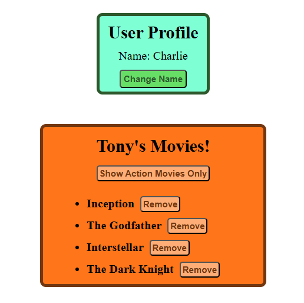

# React Vite Movie List & Profile App

---

## Mockups



---

## Overview
This is a simple React app built with Vite that displays a user profile and a list of movies. It includes functionality to change the user's name, filter movies by genre, expand movie details, and remove movies from the list.

---

## Features
- **User Profile Component**
  - Displays a user's name
  - Allows changing the name via a button click
- **Movies List Component**
  - Displays a list of movies with titles and descriptions
  - Allows users to expand/collapse movie details
  - Users can filter to show only action movies
  - Movies can be removed from the list

---

## Component Breakdown

**App.jsx**
- Renders the ```UserProfile``` and ```MoviesList``` component inside a ```<section>```

**CodeCorrection.jsx**
- A class-based component that displays a user profile.
- Includes a button to update the user's name from "Alex" to "Charlie".
- Styled with ```StyleCodeCorrection.css```.

**MoviesList.jsx**
- A functional component that displays a list of movies.
- Allows toggling movie descriptions.
- Users can remove movies form the list.
- A button filters to show only action movies.
- Styled with ```StyleMovieList.css```.

**Main.jsx**
- The entry point for rendering the ```App``` component inside ```StrictMode```.

---
## Styling

- ```StyleCodeCorrection.css```: Styles the user profile section with colors and layout.
- ```StyleMovieList.css```: Styles the movie list with background colors, layout and button styles.

---

## Technologies Used

- **React.js** (with functtional and class components)
- **Vite** (for fast development and build)
- **CSS** (for styling components)

---

## Folder Structure
```plaintext

Project Root
├── src/
│   ├── App.jsx
│   ├── CodeCorrection.jsx
│   ├── MoviesList.jsx
│   ├── Main.jsx
│   ├── StyleCodeCorrection.css
│   ├── StyleMovieList.css
│   ├── index.html
│   ├── main.css
├── package.json
├── vite.config.js
├── README.md
```